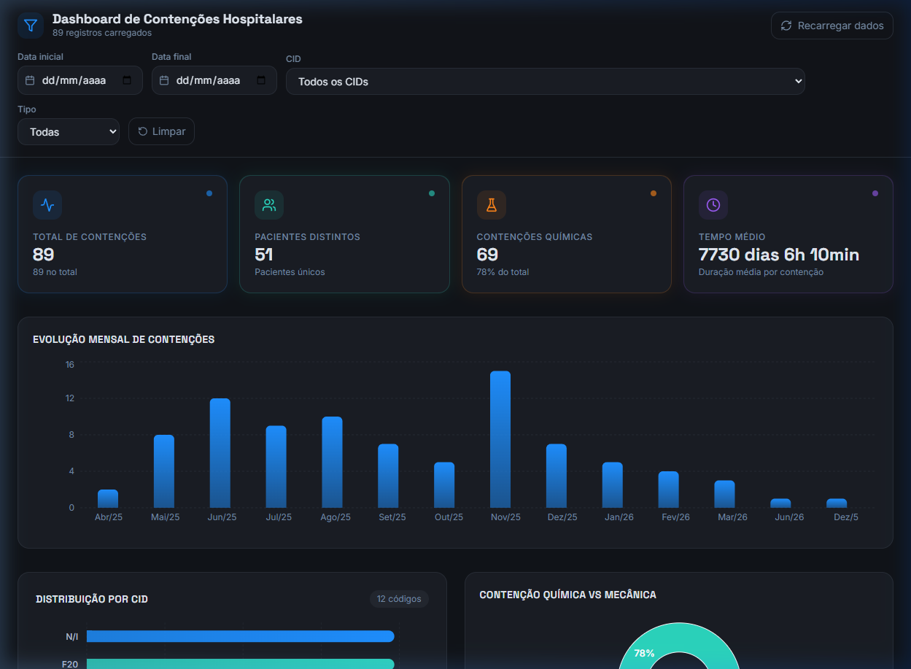
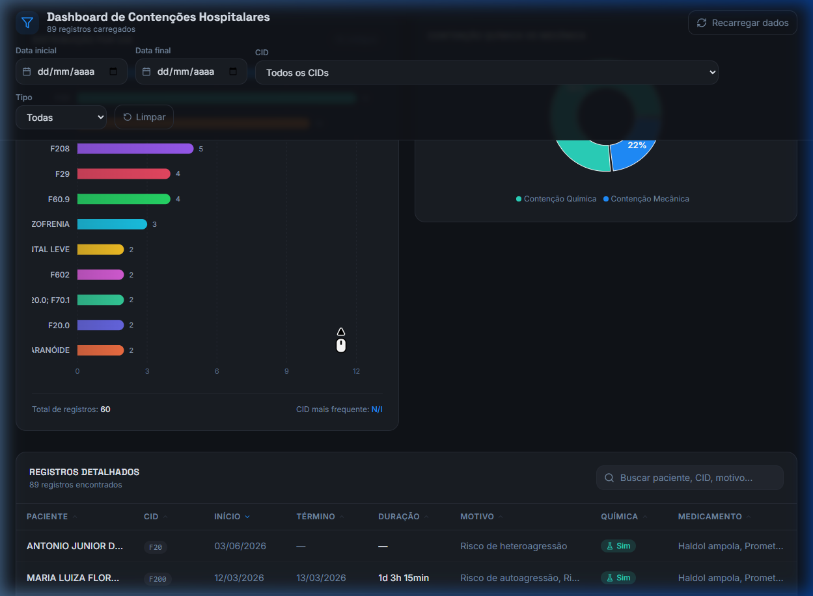

# Dashboard de Contenções Psiquiátricas

Uma aplicação analítica focada em saúde mental hospitalar para monitorar indicadores essenciais como duração de ações (mecânicas ou químicas), CIDs mais frequentes e evolução mensal de contenções.



## Funcionalidades e Características

- **Leitura Direta Automática**: Não é mais necessário subir arquivos! Os dados são puxados, de forma dinâmica e automática, diretamente a partir de um [Google Sheets](https://docs.google.com/spreadsheets/d/1yP8XVNCX0G_KXoQIxfXSj9gaBGyIyWy-j6rQ3GQnuqI/edit?usp=sharing) público preenchido pela equipe médica/gestão utilizando o formato Excel (XLSX).
- **KPIs em Tempo Real**: Cards interativos no topo com métricas rápidas de Total de Contenções, Pacientes Únicos, Contenção Química (%) e Tempo Médio das ocorrências.
- **Gráficos Dinâmicos**: Evolução diária/mensal, separação minuciosa de tipos (Mecânica e Química) usando Donut Charts, e barras de gradiente com design moderno.
- **Filtros Ágeis**: Interação em tempo real. Puxe informações por intervalo de datas (com o campo flexível padronizado) ou CID rapidamente na mesma interface unificada em topbar, sem rolagem.
- **Tema Premium Dark Mode**: Uma paleta escurecida com tons azuis vibrantes e glassmorphism pensada em criar a melhor legibilidade e evitar fadiga visual da tela durante horas de estudo de dados. Layout responsivo com max-width aprimorado para telas Full HD e telas de notebook.

## Gráficos Modernizados

O sistema conta com Recharts para as renderizações mais robustas baseadas nos dados lidos:



## Tecnologias e Stack

- [Vite](https://vitejs.dev/) - Bundle pipeline ultra-rápida.
- [React](https://react.dev/) - Biblioteca base para as engrenagens de interface e views dinâmicas.
- [Tailwind CSS](https://tailwindcss.com/) - Estilização completa unida na beleza de classes utilitárias no template em Dark Mode.
- [shadcn/ui](https://ui.shadcn.com/) - Sistema de UI componentizado.
- [Recharts](https://recharts.org/) - Geração analítica e interativa dos gráficos.
- [Framer Motion](https://www.framer.com/motion/) - Animações suaves nos modais e entrada natural de KPIs na renderização da página.

## Instruções de Inicialização

Se deseja rodar ou continuar melhorando o projeto em sua máquina local. Tenha o Node.js e o pacote npm instalados no seu ambiente.

1. Clone o repositório.
2. Acesse a pasta do projeto:
```bash
cd containment-sight
```
3. Instale as dependências essenciais:
```bash
npm install
```
4. Suba o servidor de desenvolvimento:
```bash
npm run dev
```
5. Acesse localmente (geralmente via `http://localhost:5173` ou `8080`). O projeto carregará automaticamente sua planilha online do Google Sheets.

Desenvolvido para máxima otimização da gestão e insights psiquiátricos!
